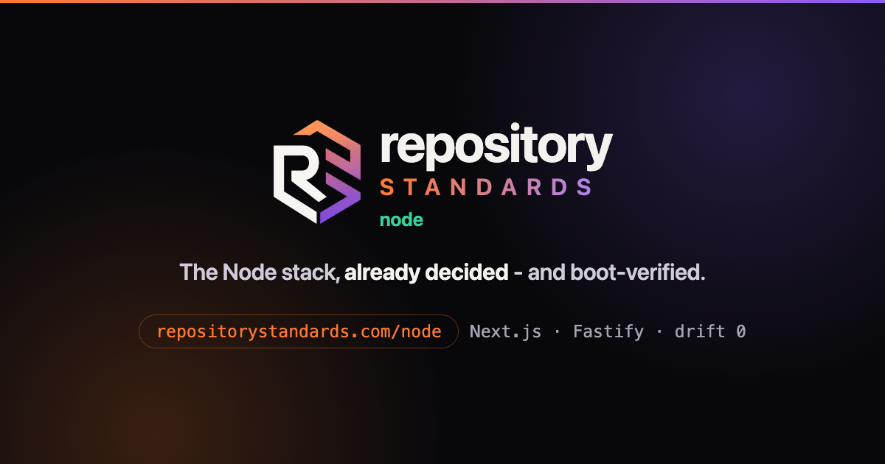

<div align="center">



### The Node stack, already decided

Next.js and Fastify behind one proxy, every pick argued and recorded,
proven by a CI run that boots the thing rather than describes it.

[**Documentation**](https://repositorystandards.com/docs/node/) &nbsp;·&nbsp;
[The decisions](DECISIONS.md) &nbsp;·&nbsp;
[The starter](starter/README.md) &nbsp;·&nbsp;
[Adopting a repo you run](ADAPTING.md) &nbsp;·&nbsp;
[The standard](https://repositorystandards.com)

</div>

---

## One sentence to your agent

```
> start a new project on repositorystandards.com with the node stack
```

Already have a repository?

```
> take this repo onto repositorystandards.com with the node stack
```

The agent reads the standard, then this layer, then asks you the few things it cannot work
out for itself. It adapts the picks to what you are building rather than handing you a tree
to reconcile - which is the difference between adopting a standard and copying a folder.

## What this is

The **stack layer** of [Repository Standards](https://repositorystandards.com): the Node and
TypeScript picks, the reasoning behind each, and a reference implementation that a weekly CI
run boots end to end. It is decisions and files, not a framework - nothing here has a version
you depend on.

One stack per technology, by policy. Variation is a profile or an adoption mode inside this
repository, never a sibling repository. The link to the core is a pointer, not a version
range: the standard is living and latest is the only target.

## What is here

| Path | What |
|---|---|
| [`DECISIONS.md`](DECISIONS.md) | the why per axis - pick, rationale, escape hatch; summary table first |
| [`starter/`](starter/) | the boot-verified monorepo: Next.js + Fastify through one proxy, Better Auth, tiered tests |
| [`stack.manifest.json`](stack.manifest.json) | the stack contract AND manifest: technology, registry back-pointer, and the file-by-file entries the align engine reads |
| [`ADAPTING.md`](ADAPTING.md) | per-entry migration notes for brownfield repos - from theirs to ours without breaking the build |

## Getting it

Both routes are one sentence to your coding agent, and both go through the standard -
this layer is picks and reference files, not a thing you install.

**A new project:**

```
> start a new project on repositorystandards.com with the node stack
```

**A repository you already run:**

```
> take this repo onto repositorystandards.com with the node stack
```

The agent reads the standard, works out which of these picks apply to what you are
building, asks you what it cannot work out for itself, and adapts. That last word is the
point: [`ADAPTING.md`](ADAPTING.md) exists because a repository with ESLint, Jest and no
workspace does not want a folder dropped on it - it wants a path, per entry, that does not
break the build on the way.

**Reading it without an agent** is a fair thing to want, and `starter/` is a real
application you can run:

```
npx degit repository-standards/node/starter my-app
cd my-app && pnpm install && pnpm dev
```

Sign-up to dashboard works with no setup, and `pnpm test:all` proves it. But treat that as
reading, not adopting: copying a tree is how a repository ends up carrying decisions nobody
made for it - which is the failure the standard exists to prevent, and it does not stop
being one here.

## Staying current

This repo's own CI boots the starter weekly (`starter-boot.yml`) - "boot-verified"
is a pulse, not a plaque. The link to the core is a pointer, not a version lock
(core ADR-022): this repo depends on the core's manifest contract, which changes
rarely and deliberately - when the core breaks it, chasing that is this repo's
bug, never the core's.
